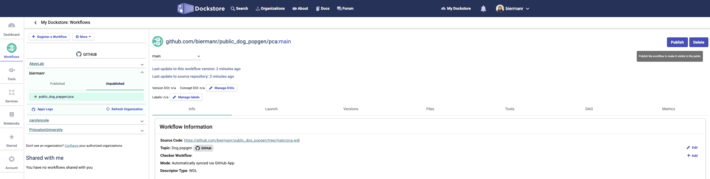
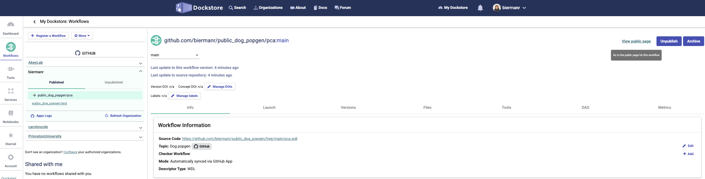
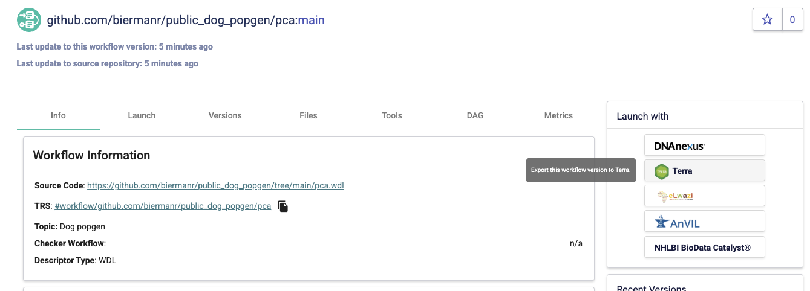
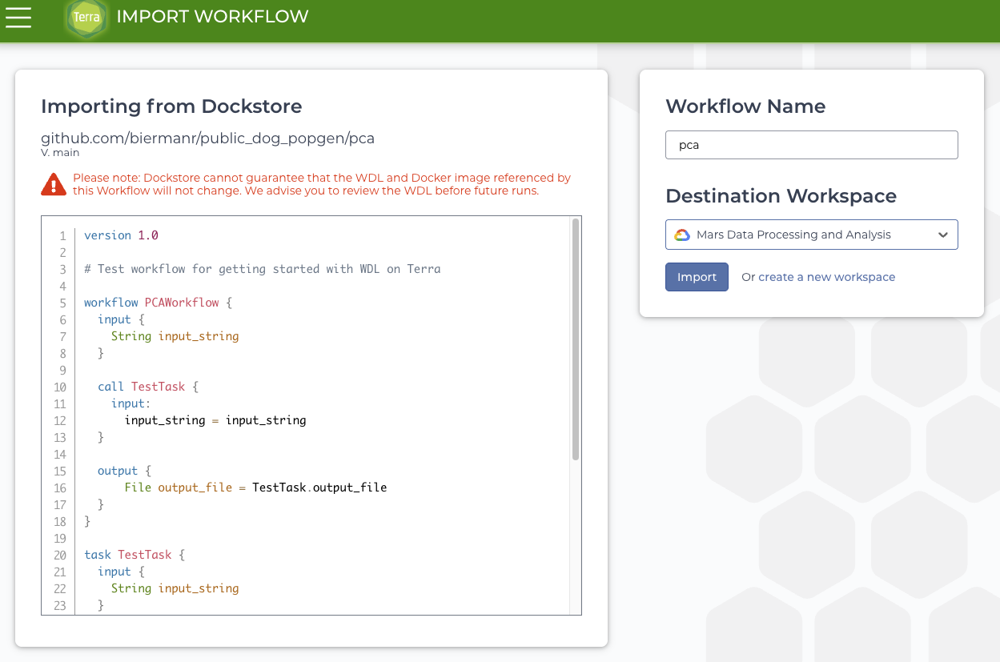
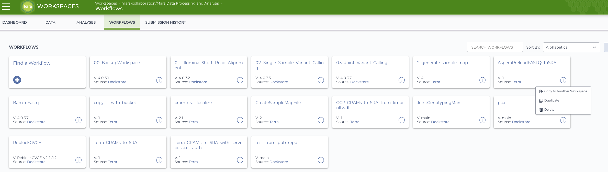

# public_dog_popgen
Dog popgen

### To update a WDL workflow (after already added, see below)
1. Edit the workflow such as `pca.wdl` then `git add`/`git push`
2. Go to Terra and run the workflow, it should be updated after 2-5 minutes (?)

### To create a new WDL workflow
1. Make the .wdl file, such as `pca.wdl`
2. Edit the `.dockstore.yml` to add the new WDL. For example
if the current `.dokstore.yml` looks like:
```yaml
version: 1.2
workflows:
  - subclass: WDL
    name: test
    primaryDescriptorPath: /test.wdl
```

then add the following lines:
```yaml
version: 1.2
workflows:
  - subclass: WDL
    name: test
    primaryDescriptorPath: /test.wdl
  - subclass: WDL
    name: pca
    primaryDescriptorPath: /pca.wdl
```

3. Then `git add` and `git push` the changes

4. Go to Dockstore, sign in under the correct account, and "publish" the workflow



5. Go to the "public page" for the workflow you just made public



6. Launch with Terra using the button on the right. You'll be taken to sign-in in Terra.



7. Import the workflow into Terra into your chosen Workspace



8. The workflow will now be available in the workspace

